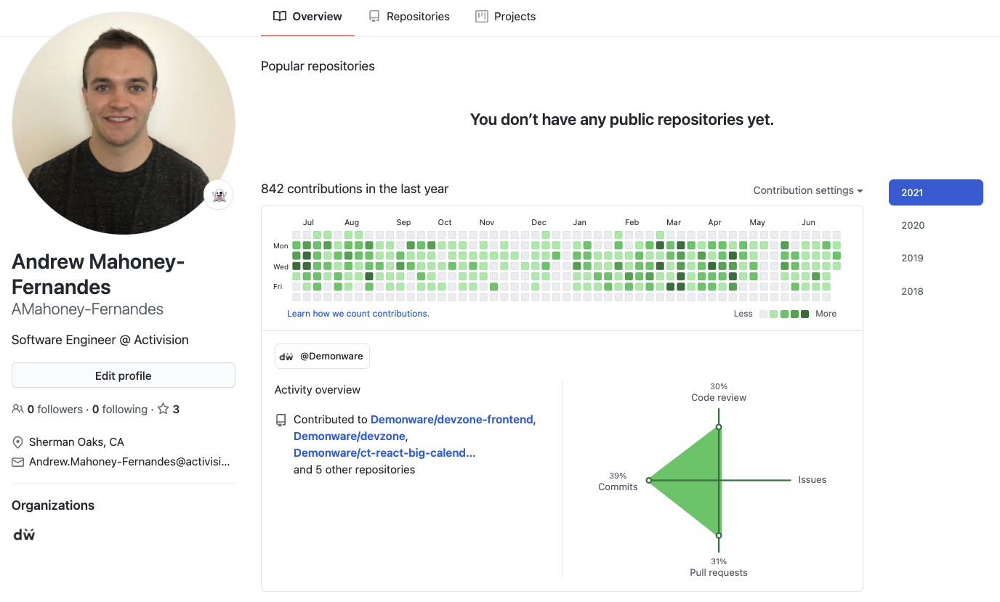
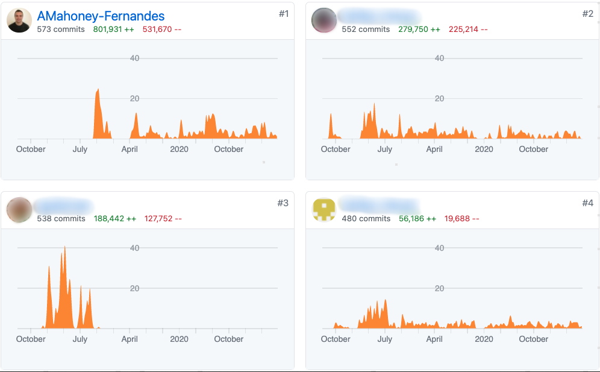

## Hello World 👋 👾

I'm **Andrew Mahoney-Fernandes**, **Co-Founder/CEO [@NiftyLeague](https://github.com/NiftyLeague)** game studio!  
I lead Web3 product and engineering efforts across our platform and games.  🎮

### 🚀  What I'm up to

At Nifty League, we develop multiplayer games and dev tools that help indie studios launch efficiently.

- ⚙️  Designing scalable, real-time game networking systems
- 🧱  Building open, player-governed game economies
- 🎮  Helping independent studios launch faster on our battle-tested framework

### 🎮  Where I’ve been

Previously, a **DevOps Engineer [@Activision](https://github.com/Activision)**, I supported live operations for one of the biggest titles in gaming — **Call of Duty**!  🪖

While much of my work was behind the scenes, here are a few snapshots showing my contributions under the hood:

  

---

🛠️ Always shipping.
